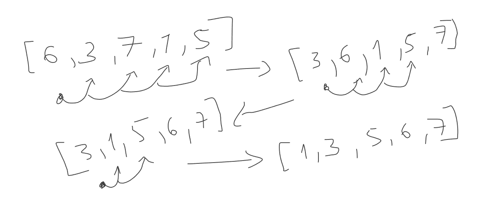

### Array buildin method

#### Array - O(1)

JS array's build in methods with constant complexity (1). When we access array

- Array.indexOf(3)
- Array[number]
- Array.push(number)
- Array.pop()

#### Array - O(n)

- When we try to loop through array, or after manipulation you make reIndexing

| Number | Function    | Complexity   |
| ------ | ----------- | ------------ |
| 1      | at          | O(1)         |
| 2      | isArray     | O(1)         |
| 3      | pop         | O(1)         |
| 4      | push        | O(1)         |
| 5      | length      | O(1)         |
| 6      | of          | O(1)         |
| -      | -           | -            |
| 7      | join        | O(n)         |
| 8      | from        | O(n)         |
| 9      | includes    | O(n)         |
| 10     | concat      | O(n)         |
| 11     | copyWithin  | O(n)         |
| 12     | entries     | O(n)         |
| 13     | every       | O(n)         |
| 14     | fill        | O(n)         |
| 15     | filter      | O(n)         |
| 16     | find        | O(n)         |
| 17     | findIndex   | O(n)         |
| 18     | flat        | O(n)         |
| 19     | flatMap     | O(n)         |
| 20     | forEach     | O(n)         |
| 21     | join        | O(n)         |
| 22     | keys        | O(n)         |
| 23     | lastIndexOf | O(n)         |
| 24     | map         | O(n)         |
| 25     | reduce      | O(n)         |
| 26     | reduceRight | O(n)         |
| 27     | reverse     | O(n)         |
| 28     | slice       | O(n)         |
| 29     | some        | O(n)         |
| 30     | toString    | O(n)         |
| 31     | unShift     | O(n)         |
| 32     | values      | O(n)         |
| 33     | sort        | O(n\*log(n)) |
| 34     | splice      | O(n+m)       |

### Array Algorithm

##### 1.BUBLE SORT

- Logic của bubble sort thứ nhất sẽ cố gắng đồn số nhỏ về bên trái
- Logic của bubble sort thứ hai sẽ cố gắng dồn số lớn về bên phải

Dựa vào context bubble sort thứ 2 chúng ta sẽ phân tích:

- Vì độ phức tạp của thuật toán là O(n^2) -> Cần lồng 2 vòng for
- Vòng for đầu tiên sẽ chạy từ idx_start đến idx_end [0; length -1)
  - Chúng không cần so sánh case idx_end vì next sẽ không còn phần tử nào
- Vòng for thứ 2 sẽ chỉ cần chạy từ idx_start đến idx_end [0; length -1) tuy nhiên qua mỗi lần loop sẽ giảm đi thêm 1 lần -> [0 ; length - 1 - i]



```js
const array1 = [6, 3, 1, 5, 7];
const array2 = [6, 3, 1, 5, 7];

const bubbleSort1 = (array) => {
  const startTime = performance.now();
  for (let i = array.length - 1; i > 0; i--) {
    for (let j = 0; j < i; j++) {
      if (array[j] > array[j + 1]) {
        let temp = array[j];
        array[j] = array[j + 1];
        array[j + 1] = temp;
      }
    }
  }
  const endTime = performance.now();
  console.log(
    'Bubble sort execution time: ' + (endTime - startTime) + ' milliseconds'
  );
  return array;
};

const bubbleSort2 = (array) => {
  const startTime = performance.now();
  for (let i = 0; i < array.length - 1; i++) {
    for (let j = 0; j < array.length - 1 - i; j++) {
      const cur = array[j];
      const next = array[j + 1];
      if (cur > next) {
        let temp = array[j];
        array[j] = array[j + 1];
        array[j + 1] = temp;
      }
    }
  }
  const endTime = performance.now();
  console.log(
    'Bubble sort execution time: ' + (endTime - startTime) + ' milliseconds'
  );
  return array;
};

console.log(bubbleSort2([...array2]));
console.log(bubbleSort1([...array1]));
```

##### 2.SELECTION SORT

Selection sort sẽ dựa vào việc ghi nhớ index và đổi chỗ item vào cuối vòng loop

```js
const array2 = [6, 3, 1, 5, 7];
function selectionSort(array) {
  let min;
  for (let i = 0; i < array.length - 1; i++) {
    min = i;
    for (let j = i + 1; j < array.length; j++) {
      if (array[min] > array[j]) min = j;
    }
    // after loop we absolutely get new minIndex
    let temp = array[i];
    array[i] = array[min];
    array[min] = temp;
  }
}
```

#### 3. Insertion sort

```js
function insertionSort(array) {
  let temp;
  for (let i = 0; i < array.length - 1; i++) {
    temp = array[i];

    for (let j = 1; array[i] > array[i - j]; j++) {
      array[i] = array[i - j];
      array[i - j] = temp;
    }
    // Không for j = 0 mà là j = i -1; để chúng ta có thể dừng ngay lập tức vòng for
    for (let j = i - 1; array[j] > temp; j--) {}

    if (array[i] > array[i + 1]) {
      array[i] = array[i + 1];
    }
  }
}
```

---
